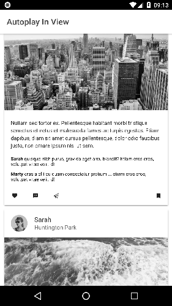

## Related post: [Autoplay videos when visible in view with Ionic 2+](https://www.ionicrun.com/autoplay-videos-when-visible-in-view-with-ionic/)

<p align="center">
  
</p>

## Step by step

```bash
$ git clone https://github.com/ionicrun/autoplay-videos-in-view-with-ionic-2.git
$ cd autoplay-videos-in-view-with-ionic-2
```

```bash
$ npm i
# or
$ ionic cordova platform add android ios
```

If any prompts show up, e.g. `[? Looks like a fresh checkout! ... ]`, answer them with `Y` (yes).

## Done

You're all set! Go ahead and serve or run the App and see the YouTube UI build with Ionic 2+ in action!

```bash
$ ionic serve
# or
$ ionic cordova run ios
# or
$ ionic cordova run android
```